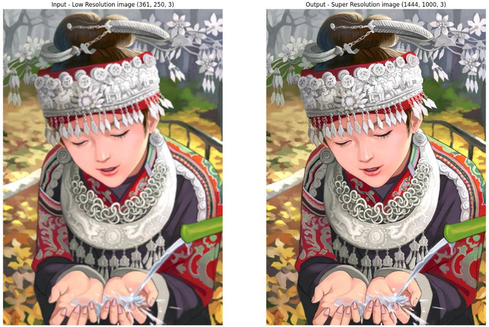

#  Image Super-Resolution using EDSR

## Overview
A TensorFlow/Keras implementation of Enhanced Deep Residual Networks for Single Image Super-Resolution (EDSR), a state-of-the-art model for achieving image super-resolution. This project provides a clean, modular, and ready-to-use codebase for training and applying EDSR to upscale your images.

🔗 **Live Demo**

Hugging Face Space and model: [click here](https://huggingface.co/spaces/MagicaNeko/edsr-4x-super-resolution)

This is an example of the super-resolution output produced by the model:




> **Paper**: [Enhanced Deep Residual Networks for Single Image Super-Resolution](https://arxiv.org/abs/1707.02921) (CVPR 2017 Workshops)  
> Lim et al. – Winner of the NTIRE 2017 Super-Resolution Challenge


## Features

*   **Model:** A modular implementation of the EDSR architecture using TensorFlow and Keras.
*   **Training Pipeline:** A complete training script (`src/train.py`) that handles data loading, augmentation, training loops, validation, and model checkpointing.
*   **Data Handling:** A custom `Sequence` data generator (`data/dataset.py`) for loading of large image datasets, with support for augmentations like random patch cropping, flipping, and rotation.
*   **Performance Metrics:** Implements standard super-resolution metrics like Peak Signal-to-Noise Ratio (PSNR) and Structural Similarity Index (SSIM) for model evaluation.
*   **Inference API:** A ready-to-use FastAPI application (`app/main.py`) to serve the super-resolution model via a REST API. It uses the ONNX runtime for efficient inference.
*   **Containerization:** A `Dockerfile` is provided for easy containerization and deployment of the inference API.
*   **Configuration:** Training and model parameters are managed through a single `config/config.yaml` file.

  
## Project Structure
```

.
├── Dockerfile              # Defines the Docker image for the API
├── requirements.txt        # Python package dependencies
├── app/
│   └── main.py             # FastAPI application for inference (expects model.onnx)
├── config/
│   └── config.yaml         # Configuration for data, training, and model
├── data/
│   ├── augmentations.py    # Data augmentation functions
│   └── dataset.py          # Custom Keras Sequence for data loading
└── src/
    ├── model.py            # EDSR model definition
    ├── train.py            # Script to train the model
    ├── inference.py        # Script for local single-image inference
    ├── metrics.py          # PSNR, SSIM, and custom loss functions
    └── utils.py            # Utility functions for evaluation

```

## Quick Start

## Setup
1.  Clone the repository:
    ```
    git clone https://github.com/muhdhammad/edsr-tensorflow.git
    cd edsr-tensorflow
    ```

2.  Install the required Python packages:
    ```
    pip install -r requirements.txt
    ```
    
## Usage

### 1. Training

1.  **Prepare your dataset:** Organize your high-resolution training and validation images. The script expects separate directories, for example:
    ```
    /path/to/your/data/
    ├── DIV2K_train_HR/
    │   ├── 0001.png
    │   └── ...
    └── DIV2K_valid_HR/
        ├── 0801.png
        └── ...
    ```

2.  **Configure training:** Edit the `config/config.yaml` file. At a minimum, set `data.hr_images_path` to the parent directory of your dataset (e.g., `/path/to/your/data/`). You can also adjust model architecture, learning rates, batch sizes, and other hyperparameters.

    ```yaml
    # config/config.yaml
    data:
      hr_images_path: C:/path/to/your/data/
      batch_size: 4
      # ... other settings
    
    training:
      num_epochs: 50
      learning_rate: 0.0001
      # ... other settings
    
    model:
      num_channels: 64
      scale_factor: 4
      num_blocks: 16
    ```

3.  **Start training:** Run the training script from the root of the project.
    ```
    python src/train.py
    ```
    The script will save the best model (`best_sr_image.keras`), the final model (`final_sr_model.keras`), and a training log (`training_log.csv`) to the directory specified in `training.checkpoints_dir` (default is `checkpoints/`).

### 2. Local Inference

You can run inference on a single image using the trained `.keras` model.

1.  Modify `src/inference.py` to point to your input image and the trained model path.
2.  Run the script:
    ```
    python src/inference.py
    ```
    This will generate the super-resolved image and save it to the specified path.
    
    Check the ```examples/``` folder for sample input 

### 3. API Deployment (FastAPI)

The repository includes a FastAPI application for serving the model. This requires an ONNX version of the model. You can convert your trained Keras model to ONNX using tools like `tf2onnx` or just use the same `keras` model.

1.  Place your converted model named `model.onnx` inside the `app/` directory.

2.  Run the API server using Uvicorn:
    ```
    uvicorn app.main:app --host 0.0.0.0 --port 8000
    ```

3.  The API is now live. You can send an image to the `/predict` endpoint to get the super-resolved version.

    Example using `curl`:
    ```
    curl -X POST -F "image=@/path/to/your/image.png" http://127.0.0.1:8000/predict > output.png
    ```

### 4. Docker Deployment

The simplest way to deploy the API is with Docker.

1.  Ensure you have a `model.onnx` file in the `app/` directory.

2.  Build the Docker image:
    ```
    docker build -t edsr-api .
    ```

3.  Run the Docker container:
    ```
    docker run -p 8000:8000 --name edsr-container edsr-api
    ```
    The API will be accessible on port 8000 of your host machine.

---

**Thanks for checking out this project!**  
If you find it useful, please consider giving it a star.

